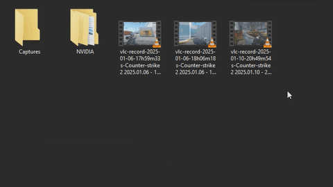

# remuxx
Convert media to audio through windows context menu.

---

## Note: If you move the EXE file, you'll have to re-enable <ins>**remuxx**</ins>.

### [FFmpeg needed!](https://www.ffmpeg.org)

First program :3 

